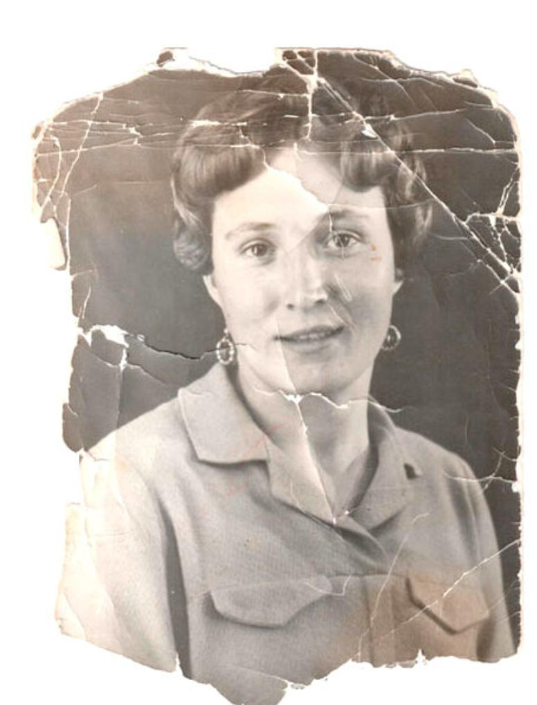
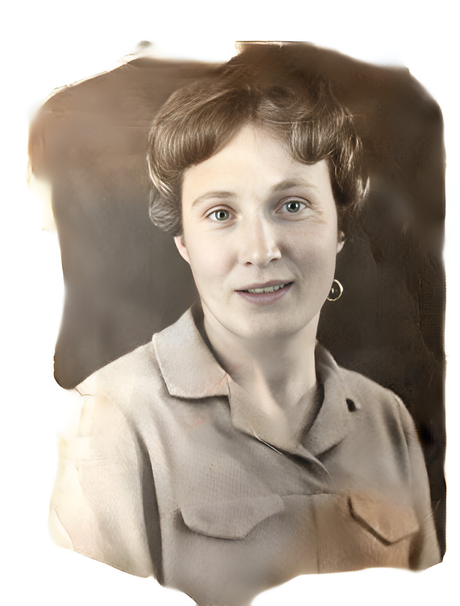
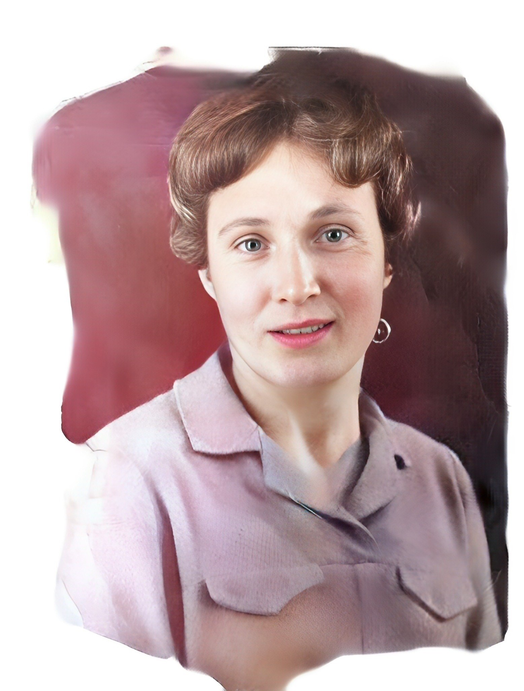

# NeuroFix — AI Photo Restoration Bot

Telegram-бот для автоматического восстановления, улучшения и анализа фотографий на основе ансамбля нейросетевых моделей.

Проект по компьютерному зрению. Основная задача — не просто подключить готовые модели, а спроектировать систему их совместной работы: собственный классификатор изображений, многошаговый авто-пайплайн обработки, асинхронная очередь задач на Redis Streams, контейнеризированная микросервисная архитектура с GPU.

---

## Демо: авто-пайплайн в действии

| Оригинал | Реставрация | Улучшение | Раскраска |
|:--------:|:-----------:|:---------:|:---------:|
|  |  |  |  |

---

## Возможности

| Функция | Описание |
|---------|----------|
| **Реставрация** | Восстановление повреждённых и старых фото — устраняет царапины, трещины, выцветание |
| **Улучшение качества** | Апскейл ×4 с восстановлением деталей лиц и текстур |
| **Раскраска** | Раскраска чёрно-белых фотографий с художественной цветовой коррекцией |
| **Анализ портрета** | Определение возраста, пола, эмоций и этнического фона |
| **Автообработка** | Интеллектуальный многошаговый пайплайн на основе анализа фото |

---

## Как это работает

```
1. Пользователь отправляет фото
        │
        ▼
2. Классификатор анализирует фото (OpenCLIP)
   → цветное или ч/б?
   → есть повреждения?
   → есть лицо?
        │
        ▼
3. Бот показывает результат анализа и кнопки действий
        │
        ├── Ручной режим: пользователь выбирает конкретное действие
        │
        └── Автообработка: бот строит цепочку шагов и запускает её
                │
                ▼
4. Задача ставится в Redis Stream нужного воркера
        │
        ▼
5. Воркер обрабатывает фото на GPU → результат в photo:results
        │
        ▼
6. Бот получает результат, отправляет пользователю
   (в авторежиме — автоматически запускает следующий шаг)
```

---

## Что разработано самостоятельно

Готовые модели — это только инструменты. Весь следующий слой написан с нуля:

- **Классификатор** — zero-shot анализ фото: определение повреждённости, цветности, наличия лица на базе CLIP-эмбеддингов и HSV-анализа
- **Авто-пайплайн** — система, которая на основе классификации строит и автоматически выполняет индивидуальную цепочку обработки
- **Маршрутизатор задач** — корреляция асинхронных задач через Redis Streams: бот сопоставляет результаты по `task_id` без прямой связи между сервисами
- **Telegram-бот** — полная логика диалога, кнопки, промежуточные результаты, обработка ошибок (aiogram 3)
- **Docker-оркестрация** — единая сеть из 7 сервисов, каждый в изолированном контейнере с доступом к GPU

---

## Ключевые технические решения

### Классификатор на OpenCLIP

Написан собственный сервис классификации на базе CLIP ViT-B/32. При получении фото выполняется цепочка проверок:

**1. Детекция лица** — CLIP сравнивает эмбеддинг изображения с текстовыми промптами `"a photo with a human face"` / `"a photo without people"`. Если лицо найдено — дальнейшие эвристики пропускаются. Это ключевое архитектурное решение: без него портреты ошибочно классифицировались как документы.

**2. Определение цветности** — анализ насыщенности пикселей в пространстве HSV. Если медианная насыщенность ниже порога — фото считается чёрно-белым. Этот подход точнее, чем CLIP-классификация для данной задачи.

**3. Детекция повреждений** — CLIP zero-shot: промпты `"old damaged scratched photo"` vs `"clean undamaged photo"`. Модель оценивает семантическое сходство и возвращает вероятность повреждения.

Результат сохраняется в Redis Hash (`classify:result:{task_id}`) с TTL — бот читает его мгновенно, без ожидания в очереди.

### Авто-пайплайн и маршрутизация задач

Бот хранит состояние каждой активной цепочки в памяти:

```python
_auto_pipeline[task_id] = {
    "chat_id": ...,
    "pipeline": ["old_photo", "enhance", "colorize"],
    "step": 0,
    "is_bw": True,
    "has_damage": True
}
```

Цепочка строится по матрице решений:

| Ч/Б | Повреждено | Пайплайн |
|:---:|:----------:|---------|
| ✓ | ✓ | реставрация → улучшение → раскраска |
| ✓ | ✗ | улучшение → раскраска |
| ✗ | ✓ | реставрация → улучшение |
| ✗ | ✗ | улучшение |

Когда приходит результат от воркера, бот проверяет наличие следующего шага: если есть — автоматически ставит новую задачу в нужный стрим с новым `task_id` и переносит состояние. Пользователь получает промежуточные фото на каждом этапе.

### Асинхронная очередь на Redis Streams

Все воркеры читают из своих именованных стримов и пишут результат в единый `photo:results`. Бот не знает, какой сервис что обрабатывает — он читает результаты и сопоставляет по `task_id`. Это позволяет обрабатывать задачи нескольких пользователей одновременно без блокировок и без прямой связи между контейнерами.

```
photo:tasks    ──► Worker      ─┐
enhance:tasks  ──► Enhancer    ─┤
colorize:tasks ──► Colorizer   ─┼──► photo:results ──► Bot
emotion:tasks  ──► Emotion     ─┤
classify:tasks ──► Classifier  ─┘
```

**Управление памятью Redis:** фотографии передаются как base64 внутри стримов. Все `XADD` вызовы ограничены `MAXLEN=50`, стрим результатов периодически подрезается до 30 записей. В процессе разработки столкнулись с проблемой: Redis уходил в OOM при накоплении ~375 записей с base64-изображениями, задачи начинали зависать. Решение — `MAXLEN` и периодическая подрезка стрима.

### Гибридный анализ портрета

Два фреймворка работают совместно, каждый на своей задаче:

- **InsightFace** — детекция лица, выравнивание (`norm_crop`), возраст и пол. Устойчив к разным ракурсам.
- **DeepFace** — анализ эмоций на уже выровненном лице от InsightFace. Получает качественный кроп, что повышает точность.

Такое разделение даёт лучший результат, чем использование одного фреймворка: каждая модель делает то, в чём сильнее.

---

## Архитектура

```
Пользователь
    │
    ▼
Telegram Bot (aiogram 3)
    │
    ├──► classify:tasks ──► Классификатор (OpenCLIP ViT-B/32)
    │         └── classify:result:{id} ──► Bot (строит пайплайн)
    │
    ├──► photo:tasks ────► Worker    (Bringing Old Photos Back to Life)
    ├──► enhance:tasks ──► Enhancer  (Real-ESRGAN + CodeFormer)
    ├──► colorize:tasks ─► Colorizer (DDColor)
    └──► emotion:tasks ──► Emotion   (InsightFace + DeepFace)
                │
                └── photo:results ──► Bot ──► Пользователь
```

Все сервисы работают в изолированной Docker-сети и общаются исключительно через Redis. Прямых HTTP-зависимостей между контейнерами нет.

---

## Стек

- **Python 3.10+** · **aiogram 3** · **Redis Streams**
- **PyTorch 2.0** · **CUDA 11.7** · **Docker Compose**
- **OpenCLIP** ViT-B/32 — классификация изображений
- **Real-ESRGAN** + **CodeFormer** — улучшение качества и восстановление лиц
- **DDColor** — художественная раскраска ч/б фото
- **InsightFace** + **DeepFace** — анализ портрета
- **Bringing Old Photos Back to Life** (Microsoft Research) — реставрация

---

## Требования

- Docker + Docker Compose
- NVIDIA GPU с поддержкой CUDA
- [NVIDIA Container Toolkit](https://docs.nvidia.com/datacenter/cloud-native/container-toolkit/install-guide.html)
- ~100 ГБ свободного места (Docker-образы + модели)

---

## Быстрый старт

### 1. Клонировать репозиторий

```bash
git clone https://github.com/WorDem125/neurofix-bot.git
cd neurofix-bot
```

### 2. Указать токен бота

```bash
cp .env.example .env
```

Открыть `.env` и вставить токен, полученный у [@BotFather](https://t.me/BotFather):

```
BOT_TOKEN=your_telegram_bot_token_here
```

### 3. Запустить

```bash
make start
```

Команда автоматически скачает модели (~1.5 ГБ) и поднимет все контейнеры. Первый запуск занимает 30–60 минут (сборка образов + загрузка весов).

---

## Управление

```bash
make start           # Запустить все сервисы
make stop            # Остановить
make restart         # Перезапустить
make status          # Статус контейнеров
make logs            # Логи всех сервисов
make logs-bot        # Логи бота
make logs-worker     # Логи воркера реставрации
make logs-enhancer   # Логи улучшения качества
make logs-colorizer  # Логи раскраски
make logs-classifier # Логи классификатора
make logs-emotion    # Логи анализа портрета
make clean           # Удалить контейнеры и volumes
```

---

## Структура проекта

```
neurofix-bot/
├── bot/            — Telegram-бот, роутинг, авто-пайплайн
├── classifier/     — Классификатор фото на OpenCLIP
├── worker/         — Реставрация старых и повреждённых фото
├── enhancer/       — Улучшение качества (Real-ESRGAN + CodeFormer)
├── colorizer/      — Раскраска ч/б фото (DDColor)
├── emotion/        — Анализ портрета (InsightFace + DeepFace)
├── scripts/        — Скрипт загрузки моделей
├── screenshots/    — Скриншоты для README
├── models/         — Веса моделей (не в git, скачиваются автоматически)
├── data/           — Временные файлы обработки (не в git)
├── docker-compose.yml
└── Makefile
```

---

## Acknowledgments

Проект использует следующие open-source библиотеки и модели:

| Репозиторий | Автор | Лицензия |
|-------------|-------|----------|
| [Bringing Old Photos Back to Life](https://github.com/microsoft/Bringing-Old-Photos-Back-to-Life) | Microsoft Research | MIT |
| [Real-ESRGAN](https://github.com/xinntao/Real-ESRGAN) | xinntao | BSD-3-Clause |
| [CodeFormer](https://github.com/sczhou/CodeFormer) | sczhou | MIT |
| [DDColor](https://github.com/piddnad/DDColor) | piddnad | Apache-2.0 |
| [InsightFace](https://github.com/deepinsight/insightface) | deepinsight | MIT |
| [DeepFace](https://github.com/serengil/deepface) | serengil | MIT |
| [OpenCLIP](https://github.com/mlfoundations/open_clip) | mlfoundations | MIT |

Код движка реставрации (`worker/engines/old_photo/`) основан на репозитории Microsoft Research и сохраняет оригинальную MIT-лицензию.

---

## Лицензия

MIT — собственный код проекта (бот, классификатор, оркестрация). Сторонние компоненты распространяются под своими лицензиями (см. таблицу выше).
